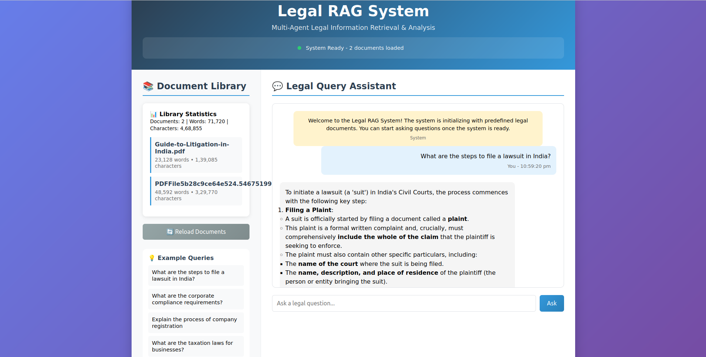

# ⚖️ LegalPrasna AI Chatbot

A **Retrieval-Augmented Generation (RAG)** based chatbot for answering legal questions, powered by:

- 🧠 **Infinity VectorDB** (by Infiniflow) for fast vector search
- 🧾 Gemmini or LLM backend for completions

---


---

## 📦 Features

- Fast, local vector search with **Infinity**
- Semantic search on legal documents
- Chat interface with context-aware Q&A
- Plug-and-play config using TOML
- Easy deployment on AWS EC2

---

## 🧰 Prerequisites

### Hardware
- ✅ Minimum: `t3.medium` EC2 instance (2 vCPU, 4GB RAM)
- ❌ Not suitable for `t3.micro`

### Software
- Python 3.10+
- Docker (optional)
- Ubuntu 20.04/22.04 or Amazon Linux 2

---

## ⚙️ Installation

### 1. Clone the repository
```bash
git clone https://github.com/zokkomon/quest_rag.git
cd quest_rag
````

### 2. Create a virtual environment

```bash
python3 -m venv venv
source venv/bin/activate
```

### 3. Install dependencies

```bash
pip install --upgrade pip
pip install -r requirements.txt
```
---

## 🔌 Running Infinity VectorDB

### 1. Download and extract Infinity

```bash
wget https://github.com/infiniflow/infinity/releases/download/v0.6.0/infinity-linux-amd64.tar.gz
tar -xvf infinity-linux-amd64.tar.gz
cd infinity
```

### 2. Create config file

Create `conf/pytest_embedded_infinity_conf.toml`:

```toml
[general]
version = "0.6.0"
time_zone = "utc-8"

[network]
server_address = "0.0.0.0"
http_port = 23820
peer_ip = "0.0.0.0"
peer_port = 23850

[log]
log_filename = "infinity.log"
log_dir = "/var/infinity/log"
log_to_stdout = true
log_level = "info"

[storage]
persistence_dir = "/var/infinity/persistence"

[buffer]
buffer_manager_size = "128MB"
temp_dir = "/var/infinity/tmp"

[wal]
wal_dir = "/var/infinity/wal"

[resource]
resource_dir = "/var/infinity/resource"

[performance]
memindex_memory_quota = "256MB"
dense_index_building_worker = 1
sparse_index_building_worker = 1
fulltext_index_building_worker = 1
```

Ensure required directories exist:

```bash
sudo mkdir -p /var/infinity/{log,persistence,tmp,wal,resource,data,snapshot}
sudo chmod -R 777 /var/infinity/
```

### 3. Run Infinity
---

## 💻 Running Project

```bash
cd quest_rag
source venv/bin/activate (for linux)
python app.py
```

---

## 🌐 Accessing the App

* **Chatbot UI**: `http://localhost:5000`

---

## 🐳 Optional: Docker Deployment

Coming soon.

---

## 📂 Project Structure

```
quest_rag/
├── backend/
│   └── main.py
├── frontend/
│   └── Home.py
├── conf/
│   └── pytest_embedded_infinity_conf.toml
├── requirements.txt
├── README.md
└── assets/
    └── chatbot_screenshot.png
```

---

## 🛠️ Troubleshooting

* **Crash on t3.micro**: Use a bigger instance like `t3.medium`.
* **Config not found**: Ensure your TOML file is in the correct location.
* **Memory issues**: Reduce `memindex_memory_quota` and buffer sizes in the config.

---

## 🤝 Credits

* [Infiniflow Infinity VectorDB](https://github.com/infiniflow/infinity)
* [OpenAI Embedding models](https://platform.openai.com)

---

## 📜 License

MIT License
